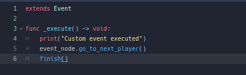

# 🪧 Godot-EventSystem
An easy but powerful event system implementation for Godot Engine

# 🪧 About the plugin
EventSystem is a Godot Plugin that will help you manage events sequentially, easy to implement and highly customizable, allowing you to execute code fragments in order according to the conditions you give it.

This plugin doesn't do much on its own, it promises to help you with the task of controlling events, but these events must be done by you. Some events of tasks commonly done in code are included in this plugin.

Whether you want to create a dialog sequence, verify that certain events have been fulfilled or an incredibly complex case maker, the possibilities are almost endless.

# Features
## 🧵 Timeline editor
A visual tool for viewing and editing sequences of events, as well as the individual properties of each event.

See, edit and control events in a timeline. The events will be executed in order, one by one.

## 🚩 Event class

Create and modify your own events, making them do exactly what you want them to do anywhere in the game.

## 🎬 Event Manager

A node prepared exclusively to run your timeline. _You don't need to worry about managing the timeline, only about when to advance in it._

# Installation
Download the lastest release and extract the ZIP file. Move the `addons` folders to the root of your project.

Open your project in Godot and enable the plugin. 

It's that easy!

If you want more information about installing plugins in Godot, please refer to [official documentation page](https://docs.godotengine.org/en/stable/tutorials/plugins/editor/installing_plugins.html).

# Documentation

All the information about the plugin you will find at [documentation page](https://anidemdex.gitbook.io/godot-dialog-plugin/). (WIP)

