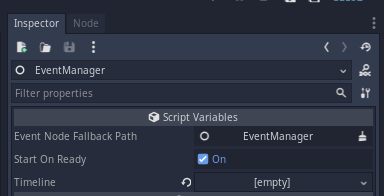

# Using the EventManager node

The EventManager node is the one that will do the job of managing your sequence (Timeline), executing the events according to the conditions that you give it.

By default, all events come with an auto-advance option: `continue_at_end`; if this value is true, at the instant the event emits its `event_finished` signal, the event manager will execute the next event automatically. Otherwise, if `continue_at_end` is false, the event handler will wait for its `go_to_next_event` method to be called to execute the next event in the list.

Usually, an scene that uses EventManager looks like this:

And these will be the default properties:

`Event Node Fallback Path` is the path to the node where the event is going to be applied. This node is used when the event doesn't define an event node path, and is relative to the current scene root.

`Start on ready` defines if the Event Manager node should start its behaviour when the scene is ready in game, or should wait until you call `EventManager.start_timeline()`.

`Timeline` is the timeline that EventManager will use for events. This is the timeline that appears in the timeline editor when you select this node.

More information about this node can be found in its [documentation section](../docs/class-event-manager.md).

