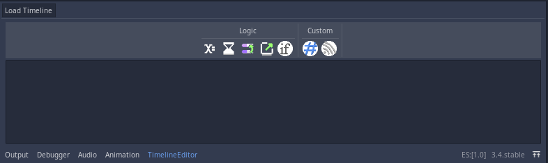

# Using the Event Editor

The event editor is a visual tool for editing any Timeline event sequence as well as the events contained in it.

The event editor consists of 3 essential parts for modifying Timeline event sequences:

1. The event buttons
2. The event list
3. The events

**The event editor appears when you select an `EventManager` node, and can be edited if that node has a proper `Timeline` resource.**

## Event buttons

Press a button to add the event to the sequence. The event will be added under the selected event or at the end of the queue.

Holding the mouse over the button allows you to see its description.

You can drag a button to generate an event that you can drop in the event list to add it at any position.

## Event list

The event list shows all events contained in the Timeline.

You can drag and drop any event from its name to rearrange or delete it.

## Events

Event nodes are a visual representation of any event. Their structure is as follows:

Pressing an event will make its properties editable in the Godot inspector.

Selecting an event and pressing the DEL (delete) button will remove the event from the Timeline.
